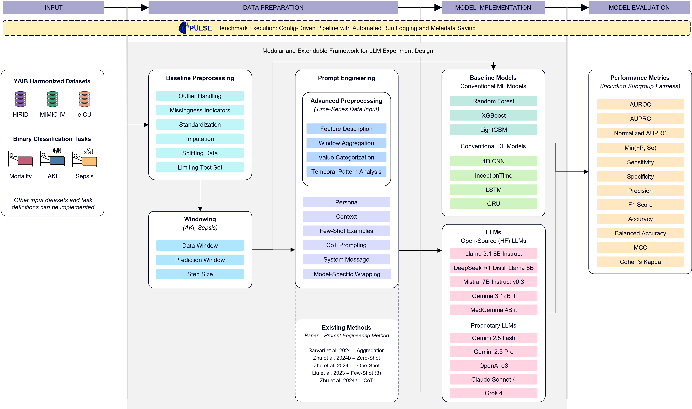

# Sepsis Prediction Using Large Language Models on ICU Data

## Overview

This repository contains the implementation for predicting sepsis, acute kidney injury and mortality in intensive care unit (ICU) patients using Large Language Models (LLMs). The project aims to leverage the power of modern language models to identify early signs of sepsis from multimodal clinical data and serves as a benchmark to compare to traditional ML approaches

## Framework Overview



## Getting started

### Installation

1. Clone the repository:

   ```bash
   git clone https://github.com/yourusername/sepsis-prediction-llm.git
   cd sepsis-prediction-llm
   ```

2. Install dependencies:
   ```bash
   pip install -r requirements.txt
   ```

## Project Structure

```
├── README.md
├── requirements.txt
├── config_train.yaml
├── config_benchmark.yaml
├── train_models.py
├── benchmark_models.py
├── src/
│   ├── data/
│   │   ├── __init__.py
│   │   ├── dataloader.py
│   ├── eval/
│   │   ├── __init__.py
│   │   └── metrics.py
│   ├── models/
│   │   ├── __init__.py
│   │   ├── modelmanager.py
│   │   └── example_model.py
│   ├── preprocessing/
│   │   ├── __init__.py
│   │   ├── preprocessing_advanced/
│   │   ├── preprocessing_baseline/
│   │   └── prompt_engineering/
|   └── framework.png
├── notebooks/
├── datasets/
└── secrets/
```

## Data

...

## Methodology

...

## Results

...

## Train a model

1. adjust config_trian.yaml
2. run train_models.py

## Evaluate a model

1. adjust config_benchmark.yaml
2. run benchmark_models.py

## Add a new model

- in config_train.yaml under models, add a new model with it's config

```json
- name: "ExampleModel"
    params:
      trainer_name: "ExampleTrainer"
      input_size: 784
      hidden_size: 128
      output_size: 10
```

- in src/models add a new file which will host the model and the trainer class

```python
class ExampleModel(PulseTemplateModel):
   def __init__(self, params: Dict[str, Any]) -> None:
      super().__init__(model_name, trainer_name)
   def set_trainer(self, trainer_name, train_dataloader, test_dataloader):
      self.trainer = ExampleTrainer(self,train_dataloader, test_dataloader)
```

```python
class ExampleTrainer():
   def __init__(self, model, train_dataloader, test_dataloader):
      self.model = model
      self.train_dataloader = train_dataloader
      self.test_dataloader = test_dataloader

   def train(self):
      # training loop
      pass

```

- add the new model name and import to the src/models/**init**.py
- adjust **getitem** method in src/data/dataloader.py for model specific preprocessing
