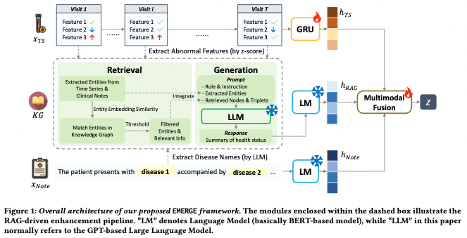

# EMERGE: Enhancing Multimodal Electronic Health Records Predictive Modeling with Retrieval-Augmented Generation
Zhu et al. (2024)  
Paper: https://dl.acm.org/doi/pdf/10.1145/3627673.3679582

## Original prompt template for summary generation

**Instruction**  
As an experienced clinical professor, you have been provided with the following information to assist in summarizing a patient's health status:

- Potential abnormal features exhibited by the patient
- Possible diseases the patient may be suffering from
- Definitions and descriptions of the corresponding diseases
- Knowledge graph triples specific to these diseases

Using this information, please create a concise and clear summary of the patient's health status. Your summary should be informative and beneficial for various healthcare prediction tasks, such as in-hospital mortality prediction and 30-day readmission prediction. Please provide your summary directly without any additional explanations.

**Potential abnormal features**  
Blood pressure too high, blood urea nitrogen too low, ...

**Potential diseases**  
['headache', 'flu', 'chest pain', ...]

**Diseases definition and description**  
[disease name]headache disorder [definition]Various conditions with the symptom of headache... [description]Headache disorders are classified into major groups, such as primary headache...  
[disease name]influenza [definition]An acute viral infection...

**Disease relationships**  
(headache disorder, indication, Acetaminophen),
(headache disorder, parent-child, intracranial hypotension),
(influenza, associated with, PARP12)...

## Modified version of the prompt for use in the PULSE benchmark

As an experienced clinical professor, you have been provided with the following information to assist in summarizing a patient's health status:

- Potential abnormal features exhibited by the patient
- Definitions and descriptions of common ICU complications (death, acute kidney injury and sepsis)

Using this information, please create a concise and clear summary of the patient's health status. Your summary should be informative and beneficial for various healthcare prediction tasks, such as in-hospital mortality prediction and prediction of the onset of acute kidney injury and sepsis. Please provide your summary directly without any additional explanations. 

...

## WIP
- How closely do we need to follow a baseline method in order to be able to include them → e.g. EMERGE: Is it valid to just use the dynamic features with too low/high for the prompt, without RAG/KG and GRU?
- include demographics?
- how to implement classification of dynamic features (normal/too high/too low) -> paper uses z-score

**Idea for how we can incorporate this approach:**
1. Categorize features into too low / normal / too high (based on median value in data window) and only mention abnormal features in the prompt
2. Give information about the task definition (how we define mortality/aki/sepsis)
3. Create patient summary
4. Use summary as input for a prediction (either just as a CoT component or as a separate prompt)