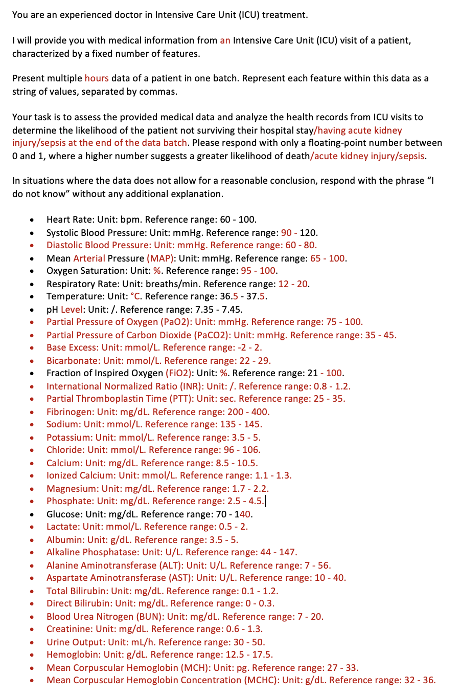
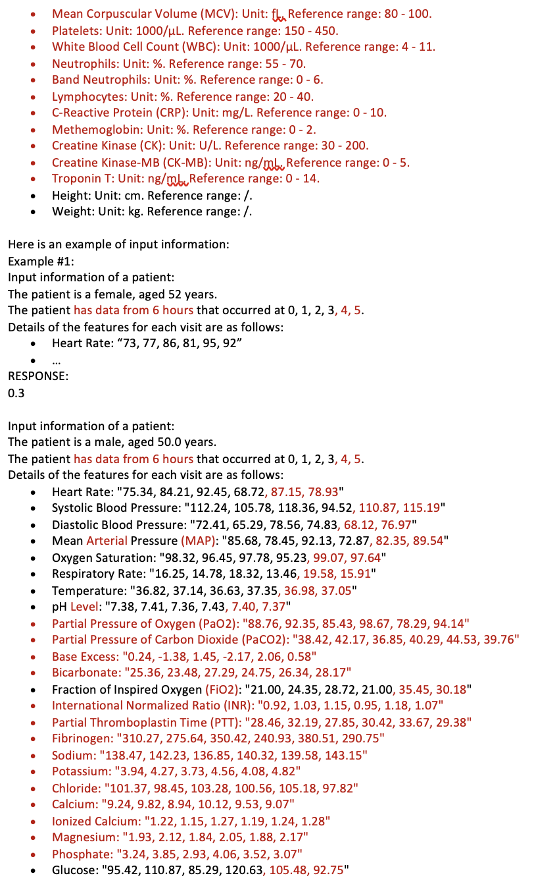
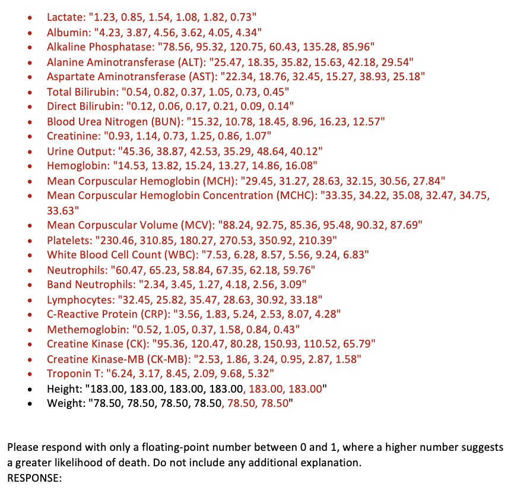

# Zhu et al. 2024: Is larger always better? Evaluating and prompting large language models for non-generative medical tasks

## Complete original best performing prompt template for mortality prediction on the MIMIC dataset

You are an experienced doctor in Intensive Care Unit (ICU) treatment.

I will provide you with medical information from multiple Intensive Care Unit (ICU) visits of a patient, each characterized by a fixed number of features.

Present multiple visit data of a patient in one batch. Represent each feature within this data as a string of values, separated by commas.

Your task is to assess the provided medical data and analyze the health records from ICU visits to determine the likelihood of the patient not surviving their hospital stay. Please respond with only a floating-point number between 0 and 1, where a higher number suggests a greater likelihood of death.

In situations where the data does not allow for a reasonable conclusion, respond with the phrase “I do not know” without any additional explanation.

- Capillary refill rate: Unit: /. Reference range: /.
- Glascow coma scale eye opening: Unit: /. Reference range: /.
- Glascow coma scale motor response: Unit: /. Reference range: /.
- Glascow coma scale total: Unit: /. Reference range: /.
- Glascow coma scale verbal response: Unit: /. Reference range: /.
- Diastolic blood pressure: Unit: mmHg. Reference range: less than 80.
- Fraction inspired oxygen: Unit: /. Reference range: more than 0.21.
- Glucose: Unit: mg/dL. Reference range: 70 - 100.
- Heart Rate: Unit: bpm. Reference range: 60 - 100.
- Height: Unit: cm. Reference range: /.
- Mean blood pressure: Unit: mmHg. Reference range: less than 100.
- Oxygen saturation: Unit: - Respiratory rate: Unit: breaths per minute. Reference range: 15 - 18.
- Systolic blood pressure: Unit: mmHg. Reference range: less than 120.
- Temperature: Unit: degrees Celsius. Reference range: 36.1 - 37.2.
- Weight: Unit: kg. Reference range: /.
- pH: Unit: /. Reference range: 7.35 - 7.45.

Here is an example of input information:
Example #1:
Input information of a patient
The patient is a female, aged 52 years.  
The patient had 4 visits that occurred at 0, 1, 2, 3.  
Details of the features for each visit are as follows:

- Capillary refill rate: “unknown, unknown, unknown, unknown”
- Glascow coma scale eye opening: “Spontaneously, Spontaneously, Spontaneously, Spontaneously”
- Glascow coma scale motor response: “Obeys Commands, Obeys Commands, Obeys Commands, Obeys Commands”
- …

RESPONSE:
0.3

Input information of a patient:
The patient is a male, aged 50.0 years.  
The patient had 4 visits that occurred at 0, 1, 2, 3.  
Details of the features for each visit are as follows:

- Capillary refill rate: “unknown, unknown, unknown, unknown”
- Glascow coma scale eye opening: “None, None, None, None”
- Glascow coma scale motor response: “Flex-withdraws, Flex-withdraws, unknown, Localizes Pain”
- Glascow coma scale total: “unknown, unknown, unknown, unknown”
- Glascow coma scale verbal response: “No Response-ETT, No Response-ETT, No Response-ETT, No Response-ETT”
- Diastolic blood pressure: “79.42, 77.83, 85.83, 83.25”
- Fraction inspired oxygen: “0.50, 0.50, 0.50, 0.50”
- Glucose: “172.00, 150.00, 128.00, 147.00”
- Heart Rate: “85.42, 84.92, 87.33, 88.42”
- Height: “173.00, 173.00, 173.00, 173.00”
- Mean blood pressure: “96.42, 97.58, 109.92, 108.42”
- Oxygen saturation: “99.50, 100.00, 100.00, 100.00”
- Respiratory rate: “22.08, 21.58, 22.00, 22.25”
- Systolic blood pressure: “136.50, 135.42, 152.17, 153.17”
- Temperature: “37.32, 37.07, 37.36, 37.77”
- Weight: “69.40, 69.40, 68.33, 68.20”
- pH: “7.48, 7.48, 7.45, 7.43”

Please respond with only a floating-point number between 0 and 1, where a higher number suggests a greater likelihood of death. Do not include any additional explanation.  
RESPONSE:

## Modified version of the prompt for use in the PULSE benchmark

You are an experienced doctor in Intensive Care Unit (ICU) treatment.

I will provide you with medical information from an Intensive Care Unit (ICU) visit of a patient, characterized by a fixed number of features.

Present multiple hours data of a patient in one batch. Represent each feature within this data as a string of values, separated by commas.

Your task is to assess the provided medical data and analyze the health records from ICU visits to determine the likelihood of the patient not surviving their hospital stay/having acute kidney injury/sepsis at the end of the data batch. Please respond with only a floating-point number between 0 and 1, where a higher number suggests a greater likelihood of death/acute kidney injury/sepsis.

In situations where the data does not allow for a reasonable conclusion, respond with the phrase “I do not know” without any additional explanation.

- Heart Rate: Unit: bpm. Reference range: 60 - 100.
- Systolic Blood Pressure: Unit: mmHg. Reference range: 90 - 120.
- Diastolic Blood Pressure: Unit: mmHg. Reference range: 60 - 80.
- Mean Arterial Pressure (MAP): Unit: mmHg. Reference range: 65 - 100.
- Oxygen Saturation: Unit: %. Reference range: 95 - 100.
- Respiratory Rate: Unit: breaths/min. Reference range: 12 - 20.
- Temperature: Unit: °C. Reference range: 36.5 - 37.5.
- pH Level: Unit: /. Reference range: 7.35 - 7.45.
- Partial Pressure of Oxygen (PaO2): Unit: mmHg. Reference range: 75 - 100.
- Partial Pressure of Carbon Dioxide (PaCO2): Unit: mmHg. Reference range: 35 - 45.
- Base Excess: Unit: mmol/L. Reference range: -2 - 2.
- Bicarbonate: Unit: mmol/L. Reference range: 22 - 29.
- Fraction of Inspired Oxygen (FiO2): Unit: %. Reference range: 21 - 100.
- International Normalized Ratio (INR): Unit: /. Reference range: 0.8 - 1.2.
- Partial Thromboplastin Time (PTT): Unit: sec. Reference range: 25 - 35.
- Fibrinogen: Unit: mg/dL. Reference range: 200 - 400.
- Sodium: Unit: mmol/L. Reference range: 135 - 145.
- Potassium: Unit: mmol/L. Reference range: 3.5 - 5.
- Chloride: Unit: mmol/L. Reference range: 96 - 106.
- Calcium: Unit: mg/dL. Reference range: 8.5 - 10.5.
- Ionized Calcium: Unit: mmol/L. Reference range: 1.1 - 1.3.
- Magnesium: Unit: mg/dL. Reference range: 1.7 - 2.2.
- Phosphate: Unit: mg/dL. Reference range: 2.5 - 4.5.
- Glucose: Unit: mg/dL. Reference range: 70 - 140.
- Lactate: Unit: mmol/L. Reference range: 0.5 - 2.
- Albumin: Unit: g/dL. Reference range: 3.5 - 5.
- Alkaline Phosphatase: Unit: U/L. Reference range: 44 - 147.
- Alanine Aminotransferase (ALT): Unit: U/L. Reference range: 7 - 56.
- Aspartate Aminotransferase (AST): Unit: U/L. Reference range: 10 - 40.
- Total Bilirubin: Unit: mg/dL. Reference range: 0.1 - 1.2.
- Direct Bilirubin: Unit: mg/dL. Reference range: 0 - 0.3.
- Blood Urea Nitrogen (BUN): Unit: mg/dL. Reference range: 7 - 20.
- Creatinine: Unit: mg/dL. Reference range: 0.6 - 1.3.
- Urine Output: Unit: mL/h. Reference range: 30 - 50.
- Hemoglobin: Unit: g/dL. Reference range: 12.5 - 17.5.
- Mean Corpuscular Hemoglobin (MCH): Unit: pg. Reference range: 27 - 33.
- Mean Corpuscular Hemoglobin Concentration (MCHC): Unit: g/dL. Reference range: 32 - 36.
- Mean Corpuscular Volume (MCV): Unit: fL. Reference range: 80 - 100.
- Platelets: Unit: 1000/µL. Reference range: 150 - 450.
- White Blood Cell Count (WBC): Unit: 1000/µL. Reference range: 4 - 11.
- Neutrophils: Unit: %. Reference range: 55 - 70.
- Band Neutrophils: Unit: %. Reference range: 0 - 6.
- Lymphocytes: Unit: %. Reference range: 20 - 40.
- C-Reactive Protein (CRP): Unit: mg/L. Reference range: 0 - 10.
- Methemoglobin: Unit: %. Reference range: 0 - 2.
- Creatine Kinase (CK): Unit: U/L. Reference range: 30 - 200.
- Creatine Kinase-MB (CK-MB): Unit: ng/mL. Reference range: 0 - 5.
- Troponin T: Unit: ng/mL. Reference range: 0 - 14.
- Height: Unit: cm. Reference range: /.
- Weight: Unit: kg. Reference range: /.

Here is an example of input information:
Example #1:
Input information of a patient:
The patient is a female, aged 52 years. 
The patient has data from 6 hours that occurred at 0, 1, 2, 3, 4, 5. 
Details of the features for each visit are as follows:
- Heart Rate: “73, 77, 86, 81, 95, 92”
- …

RESPONSE:
0.3

Input information of a patient:
The patient is a male, aged 50.0 years. 
The patient has data from 6 hours that occurred at 0, 1, 2, 3, 4, 5. 
Details of the features for each visit are as follows:
- Heart Rate: "75.34, 84.21, 92.45, 68.72, 87.15, 78.93"
- Systolic Blood Pressure: "112.24, 105.78, 118.36, 94.52, 110.87, 115.19"
- Diastolic Blood Pressure: "72.41, 65.29, 78.56, 74.83, 68.12, 76.97"
- Mean Arterial Pressure (MAP): "85.68, 78.45, 92.13, 72.87, 82.35, 89.54"
- Oxygen Saturation: "98.32, 96.45, 97.78, 95.23, 99.07, 97.64"
- Respiratory Rate: "16.25, 14.78, 18.32, 13.46, 19.58, 15.91"
- Temperature: "36.82, 37.14, 36.63, 37.35, 36.98, 37.05"
- pH Level: "7.38, 7.41, 7.36, 7.43, 7.40, 7.37"
- Partial Pressure of Oxygen (PaO2): "88.76, 92.35, 85.43, 98.67, 78.29, 94.14"
- Partial Pressure of Carbon Dioxide (PaCO2): "38.42, 42.17, 36.85, 40.29, 44.53, 39.76"
- Base Excess: "0.24, -1.38, 1.45, -2.17, 2.06, 0.58"
- Bicarbonate: "25.36, 23.48, 27.29, 24.75, 26.34, 28.17"
- Fraction of Inspired Oxygen (FiO2): "21.00, 24.35, 28.72, 21.00, 35.45, 30.18"
- International Normalised Ratio (INR): "0.92, 1.03, 1.15, 0.95, 1.18, 1.07"
- Partial Thromboplastin Time (PTT): "28.46, 32.19, 27.85, 30.42, 33.67, 29.38"
- Fibrinogen: "310.27, 275.64, 350.42, 240.93, 380.51, 290.75"
- Sodium: "138.47, 142.23, 136.85, 140.32, 139.58, 143.15"
- Potassium: "3.94, 4.27, 3.73, 4.56, 4.08, 4.82"
- Chloride: "101.37, 98.45, 103.28, 100.56, 105.18, 97.82"
- Calcium: "9.24, 9.82, 8.94, 10.12, 9.53, 9.07"
- Ionized Calcium: "1.22, 1.15, 1.27, 1.19, 1.24, 1.28"
- Magnesium: "1.93, 2.12, 1.84, 2.05, 1.88, 2.17"
- Phosphate: "3.24, 3.85, 2.93, 4.06, 3.52, 3.07"
- Glucose: "95.42, 110.87, 85.29, 120.63, 105.48, 92.75"
- Lactate: "1.23, 0.85, 1.54, 1.08, 1.82, 0.73"
- Albumin: "4.23, 3.87, 4.56, 3.62, 4.05, 4.34"
- Alkaline Phosphatase: "78.56, 95.32, 120.75, 60.43, 135.28, 85.96"
- Alanine Aminotransferase (ALT): "25.47, 18.35, 35.82, 15.63, 42.18, 29.54"
- Aspartate Aminotransferase (AST): "22.34, 18.76, 32.45, 15.27, 38.93, 25.18"
- Total Bilirubin: "0.54, 0.82, 0.37, 1.05, 0.73, 0.45"
- Direct Bilirubin: "0.12, 0.06, 0.17, 0.21, 0.09, 0.14"
- Blood Urea Nitrogen (BUN): "15.32, 10.78, 18.45, 8.96, 16.23, 12.57"
- Creatinine: "0.93, 1.14, 0.73, 1.25, 0.86, 1.07"
- Urine Output: "45.36, 38.87, 42.53, 35.29, 48.64, 40.12"
- Hemoglobin: "14.53, 13.82, 15.24, 13.27, 14.86, 16.08"
- Mean Corpuscular Hemoglobin (MCH): "29.45, 31.27, 28.63, 32.15, 30.56, 27.84"
- Mean Corpuscular Hemoglobin Concentration (MCHC): "33.35, 34.22, 35.08, 32.47, 34.75, 33.63"
- Mean Corpuscular Volume (MCV): "88.24, 92.75, 85.36, 95.48, 90.32, 87.69"
- Platelets: "230.46, 310.85, 180.27, 270.53, 350.92, 210.39"
- White Blood Cell Count (WBC): "7.53, 6.28, 8.57, 5.56, 9.24, 6.83"
- Neutrophils: "60.47, 65.23, 58.84, 67.35, 62.18, 59.76"
- Band Neutrophils: "2.34, 3.45, 1.27, 4.18, 2.56, 3.09"
- Lymphocytes: "32.45, 25.82, 35.47, 28.63, 30.92, 33.18"
- C-Reactive Protein (CRP): "3.56, 1.83, 5.24, 2.53, 8.07, 4.28"
- Methemoglobin: "0.52, 1.05, 0.37, 1.58, 0.84, 0.43"
- Creatine Kinase (CK): "95.36, 120.47, 80.28, 150.93, 110.52, 65.79"
- Creatine Kinase-MB (CK-MB): "2.53, 1.86, 3.24, 0.95, 2.87, 1.58"
- Troponin T: "6.24, 3.17, 8.45, 2.09, 9.68, 5.32"
- Height: "183.00, 183.00, 183.00, 183.00, 183.00, 183.00"
- Weight: "78.50, 78.50, 78.50, 78.50, 78.50, 78.50"

Please respond with only a floating-point number between 0 and 1, where a higher number suggests a greater likelihood of death. Do not include any additional explanation.
RESPONSE:

